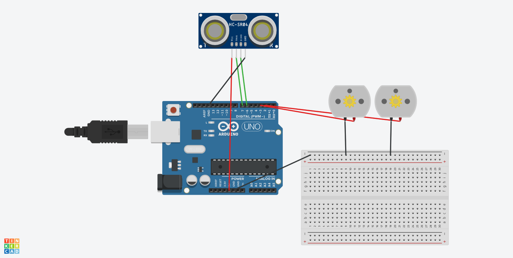

# Navigating Robot 

## Requirements
✅ Python v11+  
  
Run: `pip3 install < requirements.txt`  
   
## Introduction
Here is how to make an obstacle detecting/avoiding simple robot using ultrasonic distance sensors, DC motors and an Arduino Uno. The robot navigates itself by using the ultrasonic sensors to determine the distance from potential objects in front and when they are close enough it plays a sound and turns to a different direction and continues moving. All of the robot movement is graphed on a (x,y) plane using matplotlib in python.

Now assemble the circuit:

Here is the arduino code in C++:
```cpp
// C++ code
#define GET_DIST(t) (t/2) * 340L / 10000L
static int trig = 7;
static int echo = 6;
int duration = 0;
int distance = 0;
static int rotation_motor = 2;
static int engine_motor = 3;

void setup()
{
  Serial.begin(9600);
  pinMode(trig, OUTPUT);
  pinMode(echo, INPUT);
  digitalWrite(trig, LOW);
  pinMode(rotation_motor, OUTPUT);
  pinMode(engine_motor, OUTPUT);
}

void loop()
{
  digitalWrite(trig, HIGH);
  delay(15); 
  digitalWrite(trig, LOW);
  duration = pulseIn(echo, HIGH);
  distance = GET_DIST(duration);
  Serial.print(distance);
  Serial.print("\n");
  //Motor movement
  digitalWrite(engine_motor, LOW);
  if(distance <= 50L){
  	digitalWrite(rotation_motor, HIGH);
    delay(1500);
    digitalWrite(rotation_motor, LOW);
    serial.write(1);//Write 1 to python program 
  }
  else{
    serial.write(0);//Give 0 to python program to listen
  }
    digitalWrite(engine_motor, HIGH);
  	delay(500);
}
```
Here is the python code for the path graphing feature along with the implementation of the sound:
```python

```

